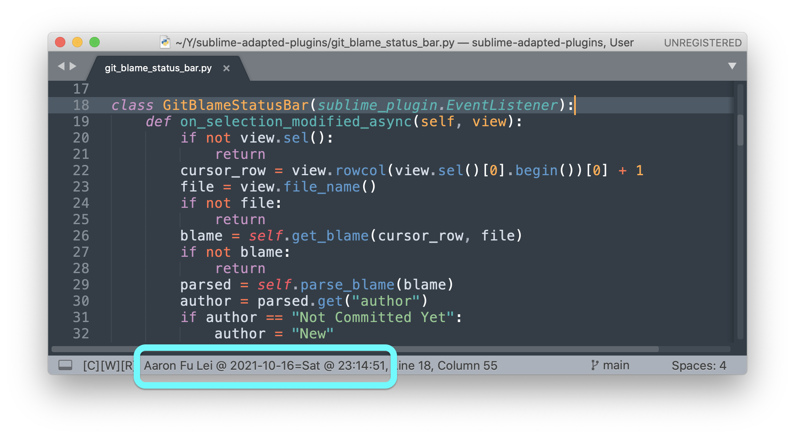

# My Adapted Plugins for Sublime Text

Sublime Text plugins that I adapt for own use.

1. [Change Selection Endpoint](#change-selection-endpoint) [`.py`](./change_selection_endpoint.py)
2. [Default Folder for New File](#default-folder-for-new-file) [`.py`](./default_folder_for_new_file.py)
3. [Git Blame Status Bar](#git-blame-status-bar) [`.py`](./git_blame_status_bar.py)
4. [Goto Last Edit](#goto-last-edit) [`.py`](./goto_last_edit.py)
5. [Recenter](#recenter) [`.py`](./recenter.py)

## Install

### Command Palette

```
1. Package Control: Add Repository

    https://github.com/aafulei/sublime-adapted-plugins

2. Package Control: Install Package

    sublime-adapted-plugins
```

## Adapted Plugins

### Change Selection Endpoint

```
Adapted from a post on Sublime Forum by Terence Martin (OdatNurd)
https://forum.sublimetext.com/t/move-caret-to-beginning-or-end-of-selection-without-losing-selection/29329/2
```

Change beginning and ending points of selections.

#### Arguments

| `order`  | Action                   |
| -------- | ------------------------ |
|       0  | swap                     |
|       1  | change to `(begin, end)` |
|      -1  | change to `(end, begin)` |

#### Recommended Key Bindings

```json
{ "keys": ["alt+m"], "command": "change_selection_endpoint" },
```


### Default Folder for New File

```
Adapted from a post on Sublime Forum and a gist by finscn
https://forum.sublimetext.com/t/default-folder-to-save-new-files
https://gist.github.com/finscn/8bc573bb3a970b1c214d
```

Set default folder to save a new file. Try

1. the same as that of last active file
2. the first opened folder

### Git Blame Status Bar

```
Adapted from a gist by Rodrigo Bermúdez Schettino
https://gist.github.com/rodrigobdz/dbcdcaac6c5af7276c63ec920ba894b0
```



### Goto Last Edit

```
Adapted from GotoLastEditEnhanced by Leonid Shagabutdinov
https://github.com/shagabutdinov/sublime-goto-last-edit-enhanced
```

Jump back to previous edits.

#### Recommended Key Bindings

```json
{ "keys": ["alt+u"], "command": "goto_last_edit" },
{ "keys": ["alt+o"], "command": "goto_last_edit", "args": { "reverse": true } },
```

### Recenter

```
Adapted from Recenter​Top​Bottom by Matt Burrows
https://github.com/mburrows/RecenterTopBottom
```

Alternate between `Show at Top` and `Show at Center`.

#### Recommended Key Bindings

```json
{ "keys": ["primary+k", "primary+k"], "command": "recenter" },
```

## License

Major credits go to the original authors. `Goto Last Edit` is under MIT. All my
adaptations are under MIT.
